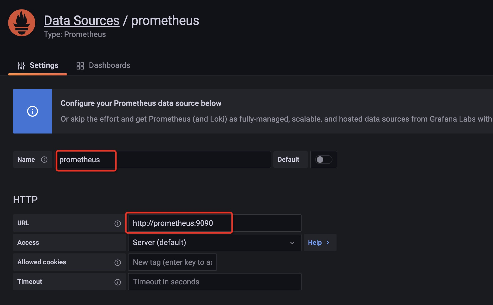

## 什么是 exemplar，为什么要用 exemplar

在可观测领域，有三种经典数据类型

- metric
- trace
- log

metric 适合用来描述一个应用的整体表现；trace 则适合用于探究某次事务的完整流程。那么我们经常遇到的一个场景就是：某个 metric 发生了波动，代表这个系统可能产生了某种问题，但是我们仅仅通过 metric 上的信息，是很难确认到底是哪些具体的请求导致了这种波动，所以就需要再通过 trace 系统去大海捞针，捞出那些异常的请求再进行分析，整体是非常低效的。

所以为了解决这个问题，exemplar 技术诞生了。它相当于为 metric 和 trace 之间建立起了一座桥梁，使用户在遇到上面的问题时，可以直接一键跳转到导致异常波动的请求的 trace 详情中，大幅提升排障的速度和精度。

## exemplar 基础概念

## 如何使用 exemplar

目前一个 golang 程序，想要使用 exemplar 能力，需要做如下几件事情

- 改造应用程序的监控埋点形式，加入 exemplar 信息
- 暴露 openmetrics 协议监控数据 
- 配置 prometheus 服务去采集 metric 数据
- 配置 tempo 服务去收集存储 trace 数据
- 配置 grafana 服务以 prometheus，tempo 为数据源，并且将二者进行关联
- 绘制开启了 exemplar 特性的 dashboard

我通过一个非常简单的 http server 样例来模拟整个流程

这个 server 最初始的状态只有一个 handler 被注册


我们将通过下面的步骤逐步为它实现 exemplar 的特性

### 监控埋点改造，加入 exemplar 信息

1.4.0 以上版本的 prometheus golang library 专门为 exemplar feature 增加新的埋点函数，使用样例如下

```golang

	requestDurationsHistogram = prometheus.NewHistogram(prometheus.HistogramOpts{
		Name:    "http_request_durations_histogram_seconds",
		Help:    "HTTP request latency distributions.",
		Buckets: []float64{.005, .01, .025, .05, .1, .25, .5, 1, 2.5, 5, 10, 25, 50, 100},
	})

    requestDurationsHistogram.(prometheus.ExemplarObserver).ObserveWithExemplar(float64(time.Since(starttime)), prometheus.Labels{
        "TraceID": traceId.String(),
    })

```

### 暴露 openmetrics 协议监控数据 

除了采用 exemplar 专用的埋点函数以外，还需要通过 prometheus client vendor 开启 openmetrics 协议的数据

```golang
	prometheus.Register(requestDurationsHistogram)
	mux.Handle("/metrics", promhttp.HandlerFor(
		prometheus.DefaultGatherer,
		promhttp.HandlerOpts{
			EnableOpenMetrics: true,
		},
	))
```

通过下面的命令可以看到带有 exemplar 信息的数据

```shell
$ curl -H "Accept: application/openmetrics-text" 127.0.0.1:7777/metrics
http_request_durations_histogram_seconds_bucket{le="0.005"} 0
....
http_request_durations_histogram_seconds_bucket{le="50.0"} 0
http_request_durations_histogram_seconds_bucket{le="100.0"} 0
http_request_durations_histogram_seconds_bucket{le="+Inf"} 1 # {TraceID="4730c8f4b45465a501b2b42e0589b891"} 6.1782157e+07 1.664375433305092e+09
http_request_durations_histogram_seconds_sum 6.1782157e+07
```

### 配置 prometheus 服务去采集 metric 数据

prometheus (2.39) 目前对 exemplar feature 的支持仍旧是通过 feature flag 开启，所以 prometheus 启动需要加上下面的启动参数

```shell
--enable-feature=exemplar-storage
```

对指标的采集配置使用 prometheus 的标准格式即可

```
scrape_configs:
- job_name: server
  honor_labels: true
  static_configs:
  - targets: ["http-server:7777"]
```

### 配置 tempo 服务去收集存储 trace 数据

tempo 服务是 grafana 开发的一款 trace 系统，支持 opentelemetry 协议，可以直接把它作为 trace 的输出目的地进行输出。

### 配置 grafana 服务以 prometheus，tempo 为数据源，并且将二者进行关联

启动 grafana 服务，配置两个数据源，

tempo 数据源

prometheus 数据源



其中配置


### 绘制开启了 exemplar 特性的 dashboard

启动

## 参考
1. https://vbehar.medium.com/using-prometheus-exemplars-to-jump-from-metrics-to-traces-in-grafana-249e721d4192
2. 
